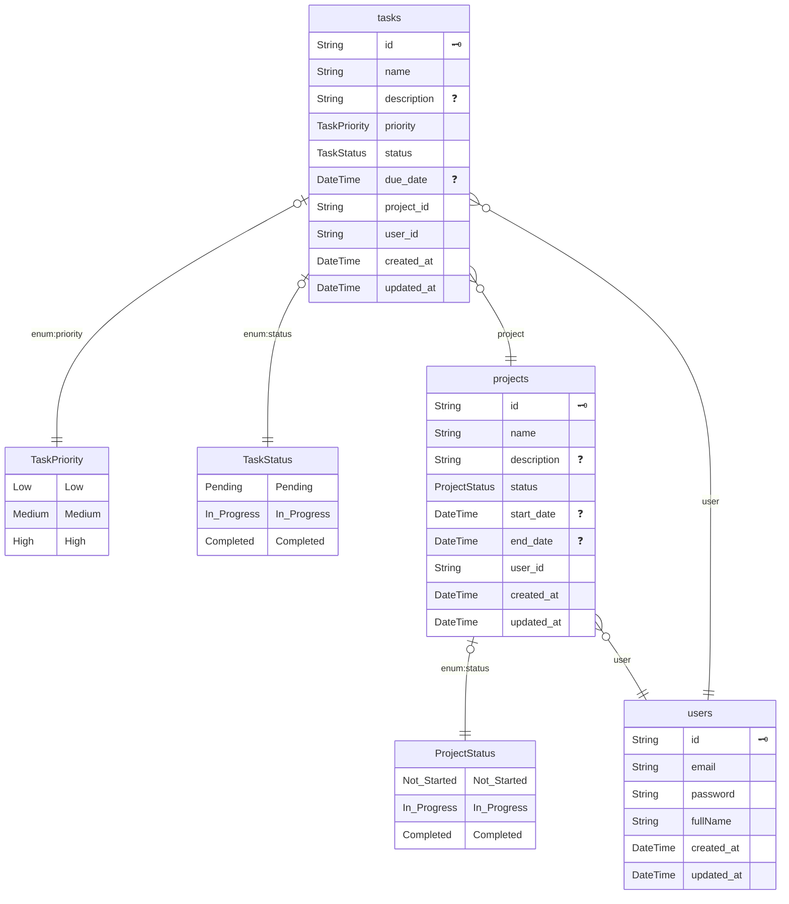

```mermaid
erDiagram

        ProjectStatus {
            Not_Started Not_Started
In_Progress In_Progress
Completed Completed
        }
    


        TaskPriority {
            Low Low
Medium Medium
High High
        }
    


        TaskStatus {
            Pending Pending
In_Progress In_Progress
Completed Completed
        }
    
  "users" {
    String id "🗝️"
    String email 
    String password 
    String fullName 
    DateTime created_at 
    DateTime updated_at 
    }
  

  "projects" {
    String id "🗝️"
    String name 
    String description "❓"
    ProjectStatus status 
    DateTime start_date "❓"
    DateTime end_date "❓"
    String user_id 
    DateTime created_at 
    DateTime updated_at 
    }
  

  "tasks" {
    String id "🗝️"
    String name 
    String description "❓"
    TaskPriority priority 
    TaskStatus status 
    DateTime due_date "❓"
    String project_id 
    String user_id 
    DateTime created_at 
    DateTime updated_at 
    }
  
    "projects" |o--|| "ProjectStatus" : "enum:status"
    "projects" }o--|| users : "user"
    "tasks" |o--|| "TaskPriority" : "enum:priority"
    "tasks" |o--|| "TaskStatus" : "enum:status"
    "tasks" }o--|| projects : "project"
    "tasks" }o--|| users : "user"
```
