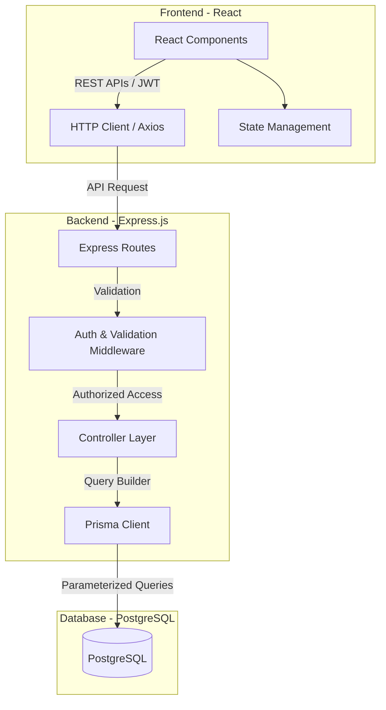

# Lead Systems Architect Specification: Project Management System (PMS)

This specification defines the architectural blueprint, security protocols, data schema, and API requirements for the Project Management System (PMS). The system will be built using a modern full-stack architecture: **React (Frontend)** and **Node.js with Express & Prisma ORM (Backend)**, backed by a **PostgreSQL Database**.

---

## 1. Architectural System Overview

The application follows a classic three-tier architecture structured to enforce data isolation, secure session state, and performant query execution.



---

## 2. Core Entities & Database Schema

The relational database schema is normalized and utilizes PostgreSQL-native features. We use Prisma ORM to ensure compile-time safety and prevent SQL injection.

### Prisma Schema (`schema.prisma`)

```prisma
datasource db {
  provider = "postgresql"
  url      = env("DATABASE_URL")
}

generator client {
  provider = "prisma-client-js"
}

// ----------------------------------------------------
// Enums
// ----------------------------------------------------

enum ProjectStatus {
  Not_Started
  In_Progress
  Completed
}

enum TaskPriority {
  Low
  Medium
  High
}

enum TaskStatus {
  Pending
  In_Progress
  Completed
}

// ----------------------------------------------------
// Models
// ----------------------------------------------------

model User {
  id        String    @id @default(uuid())
  email     String    @unique
  password  String    // Stored as bcrypt hash
  fullName  String
  projects  Project[]
  tasks     Task[]
  createdAt DateTime  @default(now()) @map("created_at")
  updatedAt DateTime  @updatedAt @map("updated_at")

  @@map("users")
}

model Project {
  id          String        @id @default(uuid())
  name        String
  description String?       @db.Text
  status      ProjectStatus @default(Not_Started)
  startDate   DateTime?     @map("start_date")
  endDate     DateTime?     @map("end_date")
  userId      String        @map("user_id")
  user        User          @relation(fields: [userId], references: [id], onDelete: Cascade)
  tasks       Task[]
  createdAt   DateTime      @default(now()) @map("created_at")
  updatedAt   DateTime      @updatedAt @map("updated_at")

  @@index([userId])
  @@map("projects")
}

model Task {
  id          String       @id @default(uuid())
  name        String
  description String?      @db.Text
  priority    TaskPriority @default(Medium)
  status      TaskStatus   @default(Pending)
  dueDate     DateTime?    @map("due_date")
  projectId   String       @map("project_id")
  project     Project      @relation(fields: [projectId], references: [id], onDelete: Cascade)
  userId      String       @map("user_id")
  user        User         @relation(fields: [userId], references: [id], onDelete: Cascade)
  createdAt   DateTime     @default(now()) @map("created_at")
  updatedAt   DateTime     @updatedAt @map("updated_at")

  @@index([projectId])
  @@index([userId])
  @@map("tasks")
}
```

### Entity Attribute Glossary

#### 1. `User` Entity
*   `id` (UUIDv4): Unique identifier, auto-generated primary key.
*   `email` (String): Unique user email. Validated against standard RFC 5322 format before insertion.
*   `password` (String): Bcrypt-hashed password. Plaintext passwords must never persist in any format.
*   `fullName` (String): Full name of the user. Cannot be empty.

#### 2. `Project` Entity
*   `id` (UUIDv4): Primary key.
*   `name` (String): Name of the project (e.g., "Website Redesign").
*   `description` (String, Optional): Rich details, mapped to PostgreSQL `TEXT`.
*   `status` (Enum): Lifecycle stage. Defaults to `Not_Started`.
    *   `Not_Started`
    *   `In_Progress`
    *   `Completed`
*   `startDate` (DateTime, Optional): Scheduled project launch window.
*   `endDate` (DateTime, Optional): Targeted project completion date.
*   `userId` (UUIDv4): Foreign key linking to `User.id`. Cascades on deletion.

#### 3. `Task` Entity
*   `id` (UUIDv4): Primary key.
*   `name` (String): Descriptive task title.
*   `description` (String, Optional): Mapped to PostgreSQL `TEXT`.
*   `priority` (Enum): Criticality level. Defaults to `Medium`.
    *   `Low`
    *   `Medium`
    *   `High`
*   `status` (Enum): Progress state. Defaults to `Pending`.
    *   `Pending`
    *   `In_Progress`
    *   `Completed`
*   `dueDate` (DateTime, Optional): Hard deadline for task completion.
*   `projectId` (UUIDv4): Foreign key referencing `Project.id`. Cascades on deletion.
*   `userId` (UUIDv4): Foreign key referencing `User.id`. Cascades on deletion.

---

## 3. Authentication & Security Architecture

### Cryptographic Standard for Passwords
*   Passwords must undergo one-way cryptographic hashing before storage.
*   **Algorithm:** `bcrypt` or `bcryptjs`.
*   **Work Factor / Salt Rounds:** Minimum of `10` rounds.
*   **Verification:** Utilize `bcrypt.compare()` for credential validation to prevent timing attacks.

### Session Management & JWT Specifications
*   **Token Standard:** JSON Web Token (JWT).
*   **Signature Algorithm:** HMAC using SHA-256 (`HS256`).
*   **Expiration Time (`exp`):** `24h` (24 hours).
*   **Payload Constraints:** Must only contain non-sensitive identity claims (e.g., `sub: userId`, `email`). **Never** store passwords, API keys, or roles in the JWT payload unless cryptographically masked.
*   **Authorization Header format:**
    ```http
    Authorization: Bearer <JWT_TOKEN>
    ```

### Strict Tenant Isolation Protocol (Preventing Data Leaks)
To eliminate Horizontal Privilege Escalation (where User A accesses User B's resources via modified IDs), every database controller lookup must enforce ownership verification.

#### Secure Project Operations Pattern
```javascript
// Fetch a specific project ensuring the authenticated user owns it
const project = await prisma.project.findFirst({
  where: {
    id: projectId,
    userId: req.currentUser.id, // Enforce tenant isolation
  },
});
if (!project) {
  return res.status(404).json({ error: "Project not found or unauthorized access" });
}
```

#### Secure Task Operations Pattern (Implicit and Explicit)
Because `Task` belongs to a `Project`, any operation on a `Task` must verify that the containing `Project` belongs to the requesting user.
```javascript
// Check ownership before modifying a task
const task = await prisma.task.findFirst({
  where: {
    id: taskId,
    project: {
      userId: req.currentUser.id // Traverses the relation to authenticate owner
    }
  }
});
if (!task) {
  return res.status(404).json({ error: "Task not found or unauthorized access" });
}
```

### Rate Limiting & Denial of Service Mitigation
Apply rate limiting on sensitive, brute-forceable endpoints like `/api/auth/login` and `/api/auth/register`.
*   **Window:** 15 minutes.
*   **Maximum Requests:** 100 requests per IP address per window.
*   **Response on Breach:** `429 Too Many Requests`.

### Database Injection Prevention
*   Direct execution of raw SQL queries (e.g., `$queryRaw` or string concatenation in queries) is **strictly prohibited**.
*   All queries must use the Prisma ORM's built-in query methods, which internally leverage parameterized inputs.

---

## 4. API Endpoints Specification

All endpoints are prefix-mounted under `/api`. Responses must be formatted as structured JSON payloads.

| Section | Method | Endpoint | Description | Request Body Structure | Auth Required | Expected HTTP Statuses |
| :--- | :--- | :--- | :--- | :--- | :---: | :--- |
| **Auth** | `POST` | `/api/auth/register` | Register a new user | `{"fullName", "email", "password"}` | No | `201 Created`, `400 Bad Request` |
| | `POST` | `/api/auth/login` | Log in and receive JWT | `{"email", "password"}` | No | `200 OK`, `400 Bad Request`, `401 Unauthorized` |
| | `POST` | `/api/auth/logout` | Invalidate token/Clear cookie | None | Yes | `200 OK`, `401 Unauthorized` |
| **Projects**| `GET` | `/api/projects` | List all projects owned by the user | None (supports search & filter query params) | Yes | `200 OK`, `401 Unauthorized` |
| | `GET` | `/api/projects/:id` | Fetch specific project details | None | Yes | `200 OK`, `401 Unauthorized`, `404 Not Found` |
| | `POST` | `/api/projects` | Create a new project | `{"name", "description"?, "status"?, "startDate"?, "endDate"?}` | Yes | `201 Created`, `400 Bad Request`, `401 Unauthorized` |
| | `PUT` | `/api/projects/:id` | Edit an existing project | `{"name"?, "description"?, "status"?, "startDate"?, "endDate"?}` | Yes | `200 OK`, `400 Bad Request`, `401 Unauthorized`, `404 Not Found` |
| | `DELETE`| `/api/projects/:id` | Delete a project and cascading tasks | None | Yes | `200 OK`, `401 Unauthorized`, `404 Not Found` |
| **Tasks** | `GET` | `/api/tasks` | List tasks across projects | Optional query param: `?projectId=...` | Yes | `200 OK`, `401 Unauthorized` |
| | `GET` | `/api/tasks/:id` | Fetch detailed task data | None | Yes | `200 OK`, `401 Unauthorized`, `404 Not Found` |
| | `POST` | `/api/tasks` | Create a task within a project | `{"projectId", "name", "description"?, "priority"?, "status"?, "dueDate"?}` | Yes | `201 Created`, `400 Bad Request`, `401 Unauthorized` |
| | `PUT` | `/api/tasks/:id` | Edit a task (or mark as completed) | `{"name"?, "description"?, "priority"?, "status"?, "dueDate"?}` | Yes | `200 OK`, `400 Bad Request`, `401 Unauthorized`, `404 Not Found` |
| | `DELETE`| `/api/tasks/:id` | Delete a task | None | Yes | `200 OK`, `401 Unauthorized`, `404 Not Found` |

---

## 5. Dashboard Metrics & Analytics Logic

The dashboard provides real-time statistics regarding projects and tasks under the current user's workspace. All aggregates must be isolated by `userId`.

### Required Metrics & Prisma Calculation Strategies

#### 1. Total Projects
*   **Description:** Total count of projects created/owned by the user.
*   **Prisma Logic:**
    ```javascript
    const totalProjects = await prisma.project.count({
      where: { userId: req.currentUser.id }
    });
    ```

#### 2. Total Tasks
*   **Description:** Count of all tasks belonging to projects owned by the user.
*   **Prisma Logic:**
    ```javascript
    const totalTasks = await prisma.task.count({
      where: {
        project: { userId: req.currentUser.id }
      }
    });
    ```

#### 3. Completed Tasks
*   **Description:** Count of tasks with status `Completed` belonging to the user's projects.
*   **Prisma Logic:**
    ```javascript
    const completedTasks = await prisma.task.count({
      where: {
        status: "Completed",
        project: { userId: req.currentUser.id }
      }
    });
    ```

#### 4. Pending Tasks
*   **Description:** Count of tasks with status `Pending` belonging to the user's projects.
*   **Prisma Logic:**
    ```javascript
    const pendingTasks = await prisma.task.count({
      where: {
        status: "Pending",
        project: { userId: req.currentUser.id }
      }
    });
    ```

#### 5. Projects In Progress
*   **Description:** Count of projects owned by the user with status `In_Progress`.
*   **Prisma Logic:**
    ```javascript
    const projectsInProgress = await prisma.project.count({
      where: {
        status: "In_Progress",
        userId: req.currentUser.id
      }
    });
    ```

---

## 6. Search, Filtering, and Sorting Specifications

The frontend must allow dynamic searching and filtering. The backend must ingest these parameters through query strings and construct dynamic Prisma filter parameters.

### Project Search & Filtering Parameters (`GET /api/projects`)
*   `search` (String): Performs a case-insensitive, partial-match search on the project name.
    *   *Prisma match expression:* `{ name: { contains: search, mode: 'insensitive' } }`
*   `status` (String): Filters projects matches against a status enum value (`Not_Started`, `In_Progress`, `Completed`).

### Task Search & Filtering Parameters (`GET /api/tasks`)
*   `search` (String): Case-insensitive partial-match search on the task name.
    *   *Prisma match expression:* `{ name: { contains: search, mode: 'insensitive' } }`
*   `projectId` (UUIDv4): Scopes tasks strictly to a specific project.
*   `status` (String): Filters tasks by state (`Pending`, `In_Progress`, `Completed`).
*   `priority` (String): Filters tasks by urgency (`Low`, `Medium`, `High`).

### Example Integration Flow for Search & Filters (Express Middleware)
```javascript
// GET /api/tasks?search=Setup&priority=High&projectId=xxxx-yyyy-zzzz
router.get("/tasks", async (req, res, next) => {
  try {
    const { search, priority, status, projectId } = req.query;
    
    // Base filter ensuring tenant isolation
    const whereClause = {
      project: { userId: req.currentUser.id }
    };

    if (projectId) {
      whereClause.projectId = projectId;
    }
    if (search) {
      whereClause.name = { contains: search, mode: "insensitive" };
    }
    if (priority) {
      whereClause.priority = priority; // e.g. "High"
    }
    if (status) {
      whereClause.status = status; // e.g. "Completed"
    }

    const tasks = await prisma.task.findMany({
      where: whereClause,
      include: {
        project: { select: { name: true } }
      },
      orderBy: { createdAt: "desc" }
    });

    res.json(tasks);
  } catch (error) {
    next(error);
  }
});
```

---

## 7. Input Validation & Error Policies

Controllers must reject malformed JSON structures before interacting with the database.

### Validation Constraints (Client & Server Side)
1.  **Emails:** Checked using validation libraries or standard regular expressions (e.g. `^[^\s@]+@[^\s@]+\.[^\s@]+$`).
2.  **Dates:** Must parse to valid ISO 8601 timestamps (`YYYY-MM-DDTHH:mm:ss.sssZ`). Start dates must precede or equal end/due dates.
3.  **Strings:** Project and Task names must contain at least 1 non-whitespace character.
4.  **Enum Matching:** Input values for status and priority fields must match the defined database enum values exactly. Malformed strings must trigger a `400 Bad Request` immediately.

### Custom Error Responses Example (400 Bad Request)
```json
{
  "success": false,
  "error": "Validation Error",
  "details": [
    {
      "field": "email",
      "message": "Invalid email address format."
    },
    {
      "field": "password",
      "message": "Password must be at least 8 characters long."
    }
  ]
}
```
